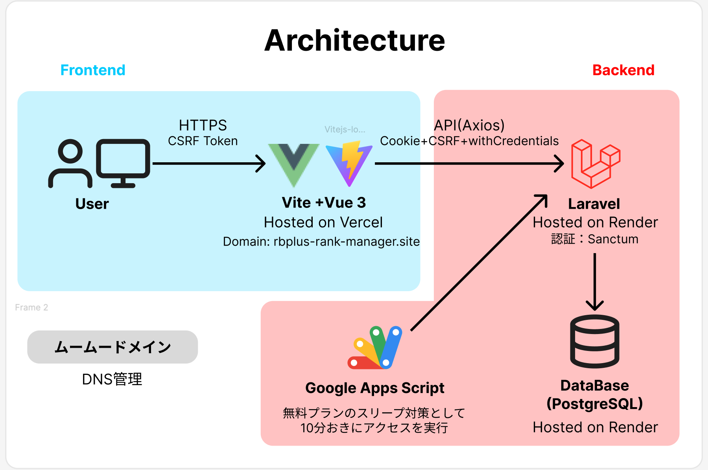

# 概要

## 背景
音楽ゲーム上級者の間では、有志によって作られた「難易度表」が使われることが多い。
例えばKONAMIの人気音楽ゲーム「beatmaniaⅡDX」は最高レベルは12であるが、Lv12の中でも難易度の差が激しく、有志によってLv12をさらに数段階に分ける試みがなされている。
近年では、難易度表をWebアプリ化してクリアランクを管理する試みがなされている。
※参考：
- [12参考表(地力表)支援サイト](https://sp12.iidx.app)
- [CPI](https://cpi.makecir.com)
この難易度表の存在により、プレイヤーは適切な難易度の曲を選ぶことができる上、自分のプレイ進捗を可視化できる。難易度表はプレイヤーのモチベーション向上に大きな貢献をしていると言えるだろう。

一方、同じくKONAMIの音楽ゲーム「REFLEC BEAT」は一時期繁栄していたが、近年はゲームのプレイ人口が激減している。
私はこのREFLEC BEATが大好きであり、SNSで「オワコン」と言われる現状に心を痛めてきた。
そこで、本作品においても難易度表兼管理アプリを開発することによって、かつてのプレイヤーのモチベーションを再燃させ、本気でKONAMIを動かすつもりで再びREFLEC BEATを繁栄させたいと思い開発に至った。
なお、「REFLEC BEAT」シリーズにはアーケード版の「REFLEC BEAT」とiOS版の「REFLEC BEAT plus」があるが、今回は手軽に遊べるiOS版の後者を対象とした。

## URL
https://rbplus-rank-manager.site

# 機能一覧
## 難易度表閲覧・スコア管理
## 設置店舗閲覧・行脚

# 使用技術

| 分類          | 使用技術・サービス                                      |
|---------------|---------------------------------------------------------|
| フロントエンド | Vue 3, Vite, TypeScript, Pinia, Vue Router, Axios     |
| バックエンド   | Laravel 12, Laravel Breeze, Laravel Sanctum            |
| インフラ       | Vercel（フロントエンド）, Render（API / DB）           |
| データベース   | SQLite（開発環境）, PostgreSQL（本番環境／Render）         |
| デザイン       | Figma（画面設計）|
| その他         | Google Maps API, GitHub, GhatGPT |

# 構成図
## アーキテクチャ構成図

このアプリケーションは Vue 3 + Vite を用いたSPAとして構築されており、Laravel（Breeze + Sanctum）と連携したセキュアな認証処理を実装しています。インフラはフロントをVercel、バックエンドとDBをRenderにホストし、無料プランのスリープ対策としてGoogle Apps Scriptで定期的にアクセスを行う構成としています。

DNS管理はムームードメインで行い、ドメイン名 `rbplus-rank-manager.site` によって独自ドメインで運用しています。

## データベース構成（ER図）

本アプリでは、ユーザー・楽曲・スコア・設置店舗・訪問履歴の5つのテーブルを中心に構成されています。リレーションの明確化と正規化を重視した設計とし、拡張性や保守性を考慮しています。

# 今後の展望