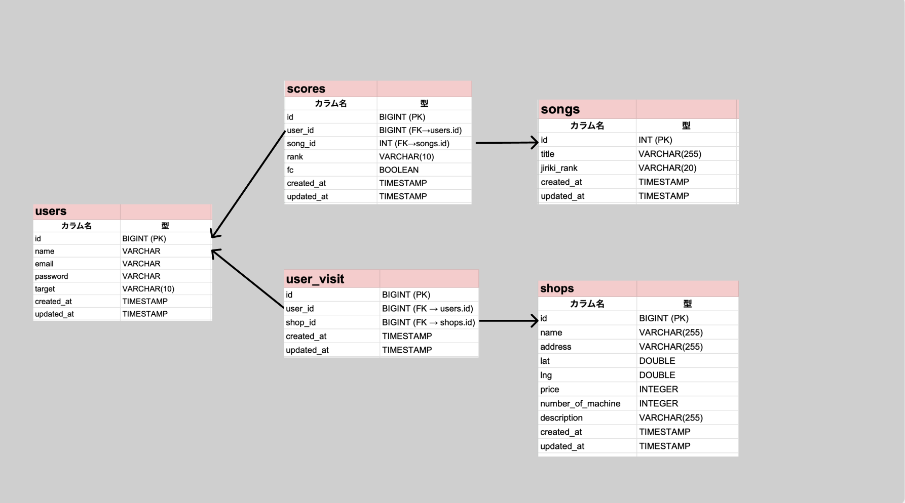

# 概要
サイト名：[REFLEC BEAT plus レベル11 難易度表＆クリアランク管理サイト](https://rbplus-rank-manager.site)

## 背景
音楽ゲーム上級者の間では、公式難易度に加えて有志による「難易度表」が活用されることが多い。 
例えばKONAMIの人気音楽ゲーム「beatmaniaⅡDX」は最高レベルは12であるが、Lv12の中でも難易度の差が激しく、有志によってLv12をさらに数段階に分ける試みがなされている。 
近年では、難易度表をWebアプリ化してクリアランクを管理する試みがなされている。 

※参考： 
- [12参考表(地力表)支援サイト](https://sp12.iidx.app)
- [CPI](https://cpi.makecir.com)
 
この難易度表の存在により、プレイヤーは適切な難易度の曲を選ぶことができる上、自分のプレイ進捗を可視化できる。難易度表はプレイヤーのモチベーション向上に大きな貢献をしていると言えるだろう。 
 
一方、同じくKONAMIの音楽ゲーム「REFLEC BEAT」は一時期繁栄していたが、近年はゲームのプレイ人口が激減している。 
私はこのREFLEC BEATが大好きであり、SNSで「オワコン」と言われる現状に心を痛めてきた。 
そこで、本作品においても難易度表兼管理アプリを開発することによって、かつてのプレイヤーのモチベーションを再燃させ、本気でKONAMIを動かすつもりで再びREFLEC BEATを繁栄させたいと思い開発に至った。 
なお、「REFLEC BEAT」シリーズにはアーケード版の「REFLEC BEAT」とiOS版の「REFLEC BEAT plus」があるが、今回は手軽に遊べるiOS版の後者を対象とした。 

## URL
https://rbplus-rank-manager.site

※検証用アカウント 
メールアドレス：test@example.com 
パスワード：password 

# 機能一覧
本アプリの機能は、メインの「難易度表閲覧・スコア管理」機能と、サブ要素として開発した「設置店舗閲覧・行脚」機能の2つに分かれる。
## 難易度表閲覧・スコア管理
### 非ログインユーザー向け
- 「REFLEC BEAT plus」収録のレベル11の全譜面について、地力ごとに分類したものを表示する（地力は非公式の10段階：地力F〜地力S+）
### ログインユーザー向け
- 曲に対してランク（AAA+/AAA/...）をプルダウンで選択すると、曲のカードがランクに対応する色に変化する
- FC（フルコンボ）をチェックボックスで選択すると、曲のカードがFULL COMBO!!と表示される
- 超上級者向けの機能として、AAA+(95%)以上のランクを1%刻みで管理できる「Expertモード」を選択できる
- フィルター機能があり、ランクとフルコンボ/未フルコンボで絞り込みができる
- 各ユーザーは目標ランクを設定することができ、目標に対する進捗状況をプログレスバーで視覚的に確認できる
- プログレスバーは達成曲数／全曲数から達成率を計算し、対応ランクの色で表示される

## 設置店舗閲覧・行脚
### 非ログインユーザー向け
- アーケード版「REFLEC BEAT」の設置店舗を地図上で確認できる
- Google Maps上にピンが立っており、クリックすると店舗詳細を確認できる
- 詳細情報では1クレ料金、台数、メンテ状況、他音ゲー情報を確認できる
### ログインユーザー向け
- ユーザーは、訪問した店舗を位置情報によるチェックインで記録することができる（これを「行脚」という）
- 店舗に近づくと店舗一覧画面に「チェックインする」ボタンが表示される
- 訪れたことのある店舗を「行脚履歴」画面で確認することができる（表示項目は「都道府県」「店舗名」「訪問日時」）

## その他機能
- ユーザーは、アカウントの新規登録・ログイン・ログアウト・削除をすることができる
- お問い合わせフォームまたはGmail、公式Xから開発者への連絡や設置店舗の情報提供ができる

# 使用技術

| 分類          | 使用技術・サービス                                      |
|---------------|---------------------------------------------------------|
| フロントエンド | Vue 3, Vite, TypeScript, Pinia, Vue Router, Axios     |
| バックエンド   | Laravel 12, Laravel Breeze, Laravel Sanctum            |
| インフラ       | Vercel（フロントエンド）, Render（バックエンド / DB）           |
| データベース   | SQLite（ローカル環境）, PostgreSQL（本番環境／Render）         |
| デザイン       | Figma（画面設計）|
| その他         | Google Maps API, GitHub, ChatGPT |

# 構成図
## アーキテクチャ構成図

このアプリケーションは Vue 3 + Vite を用いたSPAとして構築されており、Laravel（Breeze + Sanctum）と連携したセキュアな認証処理を実装している。インフラはフロントをVercel、バックエンドとDBをRenderにホストし、無料プランのスリープ対策としてGoogle Apps Scriptで定期的にアクセスを行う構成としている。

DNS管理はムームードメインで行い、ドメイン名 `rbplus-rank-manager.site` によって独自ドメインで運用している。

## データベース構成（ER図）

本アプリでは、ユーザー・楽曲・スコア・設置店舗・訪問履歴の5つのテーブルを中心に構成されている。リレーションの明確化と正規化を重視した設計とし、拡張性や保守性を考慮している。

# 今後の展望
- Google Adsenseを使った広告をつけたいが、現在審査落ちである。
- ゲームのテクニックや歴史など、wiki的な静的コンテンツを充実させたい。
- Laravel Bladeを使ってバックエンドで店舗管理画面や楽曲管理画面を作成したい。
- ユーザーから新規登録の際のバグが報告されているので、情報が集まり次第検証と改善をしたい。